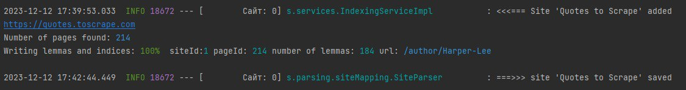
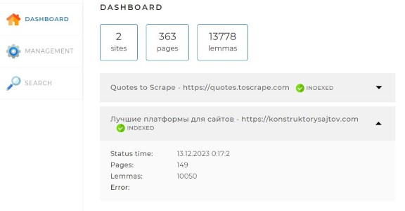

[README](../README.md)  
# Инструкция по локальному запуску проекта — последовательность команд и действий
## 1. Запуск в IntelliJ IDEA:
* Клонировать проект из репозитория (или [Download.zip](https://github.com/kolchenkoav/graduate-work-site-search-engine/archive/refs/heads/master.zip)) [github](https://github.com/kolchenkoav/graduate-work-site-search-engine)
* В settings.xml добавить [актуальный токен доступа](https://docs.google.com/document/d/1rb0ysFBLQltgLTvmh-ebaZfJSI7VwlFlEYT9V5_aPjc/edit)  
  Подробнее можно прочитать в [ТЗ](https://docs.google.com/document/d/1Xg0Q5j22dhBZ9QpZtDat6mL2po2GmTcN-dHnNfX_wTQ/edit#heading=h.td9o6twjefuq)
* Запустить Docker Desktop
* Открыть проект в IntelliJ IDEA
* Перейти в Terminal
* Ввести команды:
    1. cd docker
    2. docker compouse up
    3. Запустите созданный образ MySQL
* В [application.yam](application.yaml) добавте сайты для индексации
* Запустите приложение и откройте его через браузер по адресу: [http://localhost:8080/](http://localhost:8080/)
* Перейдите в **MANAGEMENT** и нажмите кнопку **START INDEXING**
* В консоле отражается процесс
  
* После завершения можно перейти в **DASHBOARD** и увидеть статистику (например)
  
* Для поиска необходимо перейти в **SEARCH**

## 2. Запуск jar файла
В коммандной строке набрать ' java -jar SearchEngine-1.0-SNAPSHOT.jar'